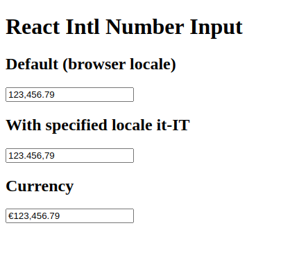

# React Intl Number Input

A React component that allows to use input `type=number` with a localized format.

> This package use [Intl number input](https://github.com/dm4t2/intl-number-input).


## Installation

Install my-project with npm

```bash
  npm install @3dsteam/react-intl-number-input
```

### Prerequisites

For this package you need to have a `.npmrc` file in your project root with the following content:

```text
@3dsteam:registry=https://npm.pkg.github.com
```

## Usage / Examples

```javascript
import React, {useState} from "react";
import IntlInputNumber from "react-intl-number-input";

function App() {
    const [value, setValue] = useState<number>(123456.789);

    const handleOnChange = (value: NumberInputValue) => {
        // Value is a NumberInputValue object
        // You can get the number value with value.number
        setValue(value.number);
    };

    return (
        <IntlInputNumber
            value={value}
            onChange={handleOnChange}
        />
    );
}
```

By default, the component use the browser locale to format the number.  
You can override this behavior by passing the `locale` in `options` props.

```javascript
import IntlInputNumber from "react-intl-number-input";

function App() {
    return <IntlInputNumber options={{ locale: "it-IT" }} />;
}
```

### Currency

You can use the `currency` option to format the number as a currency.

```javascript
import IntlInputNumber, { NumberFormatStyle } from "react-intl-number-input";

function App() {
    return (
        <IntlInputNumber
            options={{
                currency: "EUR",
                formatStyle: NumberFormatStyle.Currency,
            }}
        />
    );
}
```

## Configurations

You can see all the configurations in the [Playground](https://dm4t2.github.io/intl-number-input/playground/) powered by
[Intl Number Input](https://github.com/dm4t2/intl-number-input)

## Screenshots



## Authors

-   [@lorenzo-bonatti](https://github.com/lorenzo-bonatti)

## License

[MIT](https://choosealicense.com/licenses/mit/)
